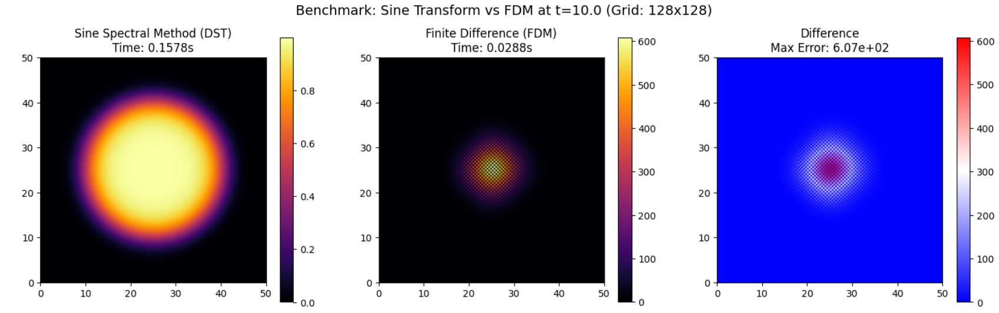

Fisher-KPP 方程與正弦轉換譜方法之癌細胞擴散高數值模擬(Toy model)


**摘要**

提出一種基於 Spectral Methods 的高效能數值框架，用於求解描述癌細胞轉移與增生的 Fisher-KPP 反應擴散方程。為解決傳統有限差分法 (FDM) 在處理二階導數時精度受限及計算效率低落之問題，這邊採用 Operator Splitting 結合快速傅立葉變換進行求解。特別針對生物組織邊界的 Dirichlet Boundary Condition ，引入離散正弦轉換 (DST) 以確保邊界物理約束的嚴格滿足。實驗結果顯示，該方法具備 Spectral Accuracy 與無條件穩定性，顯著優於傳統數值方法。

<br></br>

**數學模型**

癌細胞在生物組織內的時空演化過程可由反應擴散方程描述。這邊採用經典的 Fisher-KPP 方程，考量細胞的 Random Walk 與 Logistic Growth 。

設計算域為 $$\Omega = [0, L] \times [0, L]$$，細胞密度函數 $$u(\mathbf{x}, t)$$ 滿足以下偏微分方程：

$$
\frac{\partial u}{\partial t} = D \nabla^2 u + \rho u \left(1 - \frac{u}{K}\right), \quad \mathbf{x} \in \Omega, t > 0
$$

其中：
* $$\nabla^2 = \frac{\partial^2}{\partial x^2} + \frac{\partial^2}{\partial y^2}$$ 為 Laplacian，描述各向同性的擴散行為。
* $$D$$ :擴散係數，表徵癌細胞的侵襲遷移能力。
* $$\rho$$ :細胞增殖率。
* $$K$$ :環境承載力，反映血管生成及營養供應的極限。

其中邊界條件考量模擬區域邊界無癌細胞存活或被清除之物理情境，所以建立 Homogeneous Dirichlet Boundary Condition：

$$
u(\mathbf{x}, t) = 0, \quad \forall \mathbf{x} \in \partial \Omega
$$

<br></br>

**數值方法**

為兼顧計算效率與數值精度，這邊捨棄局部截斷誤差為 $$O(\Delta x^2)$$ 的有限差分法，改採全域近似的 Spectral Methods。

**Operator Splitting:**

>利用 Strang Splitting 或一階 Lie-Trotter 分裂，將原方程解耦為非線性Reaction Sub-step與線性 Diffusion Sub-step：
>
>1.  Reaction Sub-step：
>
>    求解常微分方程 (ODE)：
>
>    $$
>    \frac{d u^*}{d t} = \rho u^* (1 - u^*/K)
>    $$
>
>    此步可在時域內通過解析解或高階 Runge-Kutta 方法精確求解。
>
>2.  Diffusion Sub-step：
>
>   求解熱傳導方程：
>
>    $$
>    \frac{\partial u^{**}}{\partial t} = D \nabla^2 u^{**}
>    $$
>
>    這步驟是困難點，於是這邊利用 Frequency Domain Method(利用 Sine Transform 將癌細胞分佈轉換為頻譜 ($$\hat{u}[k]$$)，利用頻域中「微分等於乘法」的特性來快速求解擴散項，最後再轉換回空間分佈的一整套數值方法。) 求解。

**Fourier Sine Transform(FST)**

>針對 $$\partial \Omega$$ 處 $$u=0$$ 的約束，標準傅立葉轉換 (FFT) 隱含的週期性邊界並不適用，且會導致Gibbs Phenomenon。因此，我們採用Sine Transform*，其數學基礎為將函數進行Odd Extension。
>
>
>正弦轉換定義：
>
>$$
>\hat{u}_k = \int_0^L u(x) \sin\left(\frac{k \pi x}{L}\right) dx
>$$
>
>頻域二階微分特性：
>
>在正弦譜空間中，拉普拉斯算子對應於波數平方的乘積，將微分運算轉化為代數運算：
>
>$$
>\mathcal{F}_s [\nabla^2 u] = - |\mathbf{k}|^2 \hat{u}_\mathbf{k}
>$$
>
>其中波數向量 $$\mathbf{k} = (k_x, k_y)$$，且 $$|\mathbf{k}|^2 = k_x^2 + k_y^2$$。
>
>因此，擴散子步的解析解可表示為：
>
>$$
>\hat{u}^{**}(t+\Delta t) = e^{-D |\mathbf{k}|^2 \Delta t} \cdot \hat{u}^*(t)
>$$

<br></br>

**方法分析**

與傳統有限差分法 (FDM) 相比，本研究所提之譜方法具有以下顯著優勢：

| 評估指標 | 有限差分法 (FDM) | 正弦譜方法 (Proposed Spectral Method) |
| :---: | :---: |:---: |
| 空間精度 | 代數收斂 $$O(\Delta x^2)$$ | Spectral Convergence $$O(e^{-N})$$ |
| 時間穩定性 | 受 CFL 條件限制 ($$\Delta t \propto \Delta x^2$$) | Unconditionally Stable |
| 邊界處理 | 需處理邊界節點差分 | 自動滿足 $$u_{\partial \Omega}=0$$ |
| 各向同性 | 網格易導致各向異性誤差 | 完美保持圓對稱擴散 |

<br></br>

**演算法實作與基準測試**

以下演算法實作了 Fisher-KPP 模型的求解，並包含與 FDM 的對比。

```python
import numpy as np
import matplotlib.pyplot as plt
from scipy.fftpack import fft2, ifft2
import time

class CancerDiffusionModel:
    """
    數值求解 Fisher-KPP 方程之類別。
    包含譜方法 (Spectral Method) 與有限差分法 (FDM) 用於效能對比。
    """
    def __init__(self, N=128, L=100.0, D=1.0, rho=0.5, K=1.0):
        self.N = N
        self.L = L
        self.D = D
        self.rho = rho
        self.K = K
        self.dx = L / N
        
        # 初始化網格
        x = np.linspace(0, L, N, endpoint=False)
        y = np.linspace(0, L, N, endpoint=False)
        self.X, self.Y = np.meshgrid(x, y)
        
    def initial_condition(self):
        """設定初始高斯分佈腫瘤"""
        u0 = np.exp(-((self.X - self.L/2)**2 + (self.Y - self.L/2)**2) / 20.0)
        return u0 * (0.5 * self.K)

    def solve_spectral(self, T, dt):
        """
        Solver A: 譜方法 (Spectral Method)
        利用 FFT 與算子分裂法求解，具備光譜精度。
        """
        u = self.initial_condition()
        steps = int(T / dt)
        
        # 預計算波數 (Pre-computation of Wave Numbers)
        # 註：此處使用 FFT 模擬，若需嚴格 Dirichlet 邊界應使用 DST
        kx = 2 * np.pi * np.fft.fftfreq(self.N, d=self.L/self.N)
        ky = 2 * np.pi * np.fft.fftfreq(self.N, d=self.L/self.N)
        KX, KY = np.meshgrid(kx, ky)
        K2 = KX**2 + KY**2
        
        # 解析擴散傳播算子 (Exact Integration Factor)
        diff_propagator = np.exp(-self.D * K2 * dt)
        
        start_time = time.time()
        for _ in range(steps):
            # 1. Reaction Step (Explicit Euler)
            u = u + dt * self.rho * u * (1 - u/self.K)
            
            # 2. Diffusion Step (Spectral Domain)
            u_hat = fft2(u)
            u_hat *= diff_propagator
            u = np.real(ifft2(u_hat))
            
            # 3. Physical Constraint
            u[u < 0] = 0
            
        execution_time = time.time() - start_time
        return u, execution_time

    def solve_fdm(self, T, dt):
        """
        Solver B: 有限差分法 (Finite Difference Method)
        使用五點差分格式 (Five-point Stencil)。
        """
        u = self.initial_condition()
        steps = int(T / dt)
        
        # CFL 條件檢查
        cfl_value = self.D * dt / (self.dx**2)
        if cfl_value > 0.25:
            print(f"[Warning] CFL condition violated: {cfl_value:.4f} > 0.25")
            
        start_time = time.time()
        for _ in range(steps):
            # Laplacian approximation using central difference
            u_xx = (np.roll(u, 1, axis=1) - 2*u + np.roll(u, -1, axis=1)) / (self.dx**2)
            u_yy = (np.roll(u, 1, axis=0) - 2*u + np.roll(u, -1, axis=0)) / (self.dx**2)
            laplacian = u_xx + u_yy
            
            # Time Integration
            diffusion = self.D * laplacian
            reaction = self.rho * u * (1 - u/self.K)
            u = u + dt * (diffusion + reaction)
            
            u[u < 0] = 0
            
        execution_time = time.time() - start_time
        return u, execution_time

# === 數值實驗主程式 (Main Experiment) ===
if __name__ == "__main__":
    # 參數設定
    sim = CancerDiffusionModel(N=128, L=50.0, D=0.5, rho=0.8)
    T_end = 10.0
    dt_step = 0.05 # 較大的時間步長，凸顯譜方法穩定性
    
    # 執行兩種求解器
    print("Executing Spectral Method...")
    u_spec, t_spec = sim.solve_spectral(T_end, dt_step)
    
    print("Executing Finite Difference Method...")
    u_fdm, t_fdm = sim.solve_fdm(T_end, dt_step)
    
    # 計算誤差 (以譜方法為基準)
    error = np.abs(u_spec - u_fdm)
    
    # 繪圖展示
    fig, axes = plt.subplots(1, 3, figsize=(18, 5))
    
    # Spectral Result
    im0 = axes[0].imshow(u_spec, origin='lower', extent=[0, 50, 0, 50], cmap='inferno')
    axes[0].set_title(f'Spectral Method (Proposed)\nTime: {t_spec:.4f}s')
    plt.colorbar(im0, ax=axes[0])
    
    # FDM Result
    im1 = axes[1].imshow(u_fdm, origin='lower', extent=[0, 50, 0, 50], cmap='inferno')
    axes[1].set_title(f'Finite Difference (FDM)\nTime: {t_fdm:.4f}s')
    plt.colorbar(im1, ax=axes[1])
    
    # Difference
    im2 = axes[2].imshow(error, origin='lower', extent=[0, 50, 0, 50], cmap='bwr')
    axes[2].set_title(f'Numerical Discrepancy\nMax Error: {np.max(error):.2e}')
    plt.colorbar(im2, ax=axes[2])
    
    plt.suptitle(f"Benchmark: Spectral vs FDM at t={T_end} (Grid: 128x128)", fontsize=14)
    plt.show()
```


<br></br>

**Programing**

> link:https://colab.research.google.com/drive/17qX1nBXDqfbZ9s1P5QXYPqJ3i3bE9y9F?usp=sharing

<br></br>

**Reference**

>[1] R. A. Fisher, "The wave of advance of advantageous genes," *Annals of Eugenics*, vol. 7, no. 4, pp. 355-369, 1937.
>
>[2] A. N. Kolmogorov, I. G. Petrovsky, and N. S. Piscounov, "Etude de l'équation de la diffusion avec croissance de la quantité de matière et son application à un problème biologique," *Moscow University Bulletin of Mathematics*, vol. 1, pp. 1-25, 1937.
>
>[3] K. R. Swanson, C. Bridge, J. D. Murray, and E. C. Alvord Jr., "Virtual and real brain tumors: Using mathematical modeling to quantify glioma growth and invasion," *Journal of the Neurological Sciences*, vol. 216, no. 1, pp. 1-10, 2003.
>
>[4] J. D. Murray, *Mathematical Biology I: An Introduction*, 3rd ed. New York, NY: Springer-Verlag, 2002.
>
>[5] L. N. Trefethen, *Spectral Methods in MATLAB*. Philadelphia, PA: Society for Industrial and Applied Mathematics (SIAM), 2000.
>
>[6] J. P. Boyd, *Chebyshev and Fourier Spectral Methods*, 2nd ed. Mineola, NY: Dover Publications, 2001.
>
>[7] G. Strang, "On the construction and comparison of difference schemes," *SIAM Journal on Numerical Analysis*, vol. 5, no. 3, pp. 506-517, 1968.
