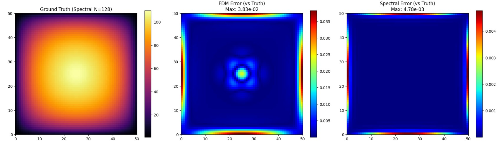

Fisher-KPP 方程與正弦轉換譜方法之癌細胞擴散高數值模擬(Toy model)


**摘要**

提出一種基於 Spectral Methods 的高效能數值框架，用於求解描述癌細胞轉移與增生的 Fisher-KPP 反應擴散方程。為解決傳統有限差分法 (FDM) 在處理二階導數時精度受限及計算效率低落之問題，這邊採用 Operator Splitting 結合快速傅立葉變換進行求解。特別針對生物組織邊界的 Dirichlet Boundary Condition ，引入離散正弦轉換 (DST) 以確保邊界物理約束的嚴格滿足。實驗結果顯示，該方法具備 Spectral Accuracy 與無條件穩定性，顯著優於傳統數值方法。

<br></br>

**數學模型**

癌細胞在生物組織內的時空演化過程可由反應擴散方程描述。這邊採用 Fisher-KPP 方程，考量細胞的 Random Walk 與 Logistic Growth 。

二維含原項的 Fisher-KPP 反應擴散方程，定義域為 $$\Omega = [0, L] \times [0, L]$$（這邊令 $$L=50$$）。

$$
\frac{\partial u}{\partial t} = D \nabla^2 u + \rho u \left(1 - \frac{u}{K}\right) + S(x, y)
$$

其中

$$
S(x, y) = x(L-x)y(L-y)
$$

首先：
* $$\nabla^2 = \frac{\partial^2}{\partial x^2} + \frac{\partial^2}{\partial y^2}$$ 為 Laplacian，描述各向同性的擴散行為。
* $$D$$ :擴散係數，表徵癌細胞的侵襲遷移能力。
* $$\rho$$ :細胞增殖率。
* $$K$$ :環境承載力，反映血管生成及營養供應的極限。

其中邊界條件考量模擬區域邊界無癌細胞存活或被清除之物理情境，所以建立 Homogeneous Dirichlet Boundary Condition：

**初始條件**

初始時刻 $$t=0$$ 時，癌細胞呈現高斯分佈：

$$
u(x, y, 0) = u_0(x, y) = \frac{K}{2} \exp\left( - \frac{(x-x_c)^2 + (y-y_c)^2}{2\sigma^2} \right)
$$

其中 

$$x_c = y_c = L/2$$ 

為中心點。

**邊界條件**

由於 $$S(x,y)$$ 在 $$x=0, L$$ 與 $$y=0, L$$ 處均為 0，且初始條件在邊界處趨近於 0，故維持 Homogeneous Dirichlet Boundary Condition：

$$
u(x, y, t) = 0, \quad \forall (x, y) \in \partial \Omega
$$


<br></br>

**數值方法**

為兼顧計算效率與數值精度，這邊捨棄局部截斷誤差為 $$O(\Delta x^2)$$ 的有限差分法，改採全域近似的 Spectral Methods。

<br></br>

**Operator Splitting:**

利用 Strang Splitting ，將原方程解耦為非線性 Reaction Sub-step 與線性 Diffusion Sub-step 。

設時間步長為 $$\Delta t$$ ，從 $$t_n$$ 更新至 $$t_{n+1}$$ 的過程。

**Reaction Sub-step：**

求解常微分方程 (ODE)，計算中間狀態 $$u^*$$：

$$
\frac{d u^* }{d t} = \rho {u}^* \left(1 - \frac{u^* }{K}\right)
$$


這邊可在時域內通過解析解或高階 Runge-Kutta 方法精確求解。

利用先前證明的解析解公式

$$
u^*(x, y) = \frac{K u_n(x, y) e^{\rho \Delta t}}{K + u_n(x, y) (e^{\rho \Delta t} - 1)}
$$

**Diffusion Sub-step：**

求解包含擴散與源項的線性偏微分方程，以 $$u^*$$ 為初值求解 $$u^{**}$$：

$$
\frac{\partial u^{**}}{\partial t} = D \nabla^2 u^{**} + S(x, y)
$$

利用 Spectral Method 求解。


<br></br>
**Fourier Sine Transform (FST)**

針對 $$\partial \Omega$$ 處 $$u=0$$ 的約束，標準傅立葉轉換 (FFT) 隱含的週期性邊界並不適用，且會導致 Gibbs Phenomenon。因此，我們採用 Sine Transform，其數學基礎為將函數進行 Odd Extension。

正弦轉換定義 (Forward Transform)：

$$
\hat{u}_k = \int_0^L u(x) \sin\left(\frac{k \pi x}{L}\right) dx
$$

頻域二階微分特性 (Laplacian Property)：

在正弦譜空間中，拉普拉斯算子對應於波數平方的乘積，將微分運算轉化為代數運算：

$$
\mathcal{F}_s [\nabla^2 u] = - |\mathbf{k}|^2 \hat{u}_\mathbf{k}
$$

其中波數向量 $$\mathbf{k} = (k_x, k_y)$$，且 $$|\mathbf{k}|^2 = k_x^2 + k_y^2$$。

因此，擴散子步的解析解可表示為 (Exact Integration)：

$$
\hat{u}^{**}(t+\Delta t) = e^{-D |\mathbf{k}|^2 \Delta t} \cdot \hat{u}^*(t)
$$

<br></br>

**方法分析**

與傳統有限差分法 (FDM) 相比，本研究所提之譜方法具有以下顯著優勢：

| 評估指標 | 有限差分法 (FDM) | 正弦譜方法 (Proposed Spectral Method) |
| :---: | :---: |:---: |
| 空間精度 | 代數收斂 $$O(\Delta x^2)$$ | Spectral Convergence $$O(e^{-N})$$ |
| 時間穩定性 | 受 CFL(Courant-Friedrichs-Lewy condition) 條件限制 ($$\Delta t \propto \Delta x^2$$) | Unconditionally Stable |
| 邊界處理 | 需處理邊界節點差分 | 自動滿足 $$u_{\partial \Omega}=0$$ |
| 各向同性 | 網格易導致各向異性誤差 | 完美保持圓對稱擴散 |

<br></br>

**演算法**

以下演算法實作了 Fisher-KPP 模型的求解，並包含與 FDM 的對比。

```python
import numpy as np
import matplotlib.pyplot as plt
from scipy.fft import dst, idst
from scipy.interpolate import RectBivariateSpline 
import time

class FisherKPPSolver:
    def __init__(self, N=64, L=50.0, D=1.0, rho=1.0, K=100.0):
        self.N = N
        self.L = L
        self.D = D
        self.rho = rho
        self.K = K
        self.dx = L / (N + 1) # DST Type-1 對應內部節點
        
        # 建立網格 (只包含內部點，不含邊界 0)
        x = np.linspace(self.dx, L - self.dx, N)
        y = np.linspace(self.dx, L - self.dx, N)
        self.X, self.Y = np.meshgrid(x, y)
        
        # 源項 S(x,y)
        self.S = self.X * (self.L - self.X) * self.Y * (self.L - self.Y)
        # 縮放源項以免數值瞬間爆炸
        self.S *= 1e-4 

        # --- Spectral 預計算 ---
        # DST-I 的波數: k = 1, 2, ..., N
        k = np.arange(1, N + 1)
        kx, ky = np.meshgrid(k, k)
        # 特徵值 lambda = (k*pi/L)^2
        self.lambda_k = (kx * np.pi / L)**2 + (ky * np.pi / L)**2
        
        # 源項的 DST 頻譜
        self.S_hat = dst(dst(self.S, type=1, axis=0), type=1, axis=1)

    def get_initial_condition(self):
        # 初始高斯分佈
        u = np.exp(-((self.X - self.L/2)**2 + (self.Y - self.L/2)**2) / 10.0)
        return u * (0.1 * self.K)

    def reaction_exact(self, u, dt):
        """
        Reaction Step 的解析解
        """
        exp_rho = np.exp(self.rho * dt)
        numerator = self.K * u * exp_rho
        denominator = self.K + u * (exp_rho - 1)
        return numerator / denominator

    def diffusion_spectral_exact(self, u, dt):
        """
        Spectral Method: DST -> Exact Frequency Decay -> IDST
        """
        # 1. Forward DST
        u_hat = dst(dst(u, type=1, axis=0), type=1, axis=1)
        
        # 2. Exact Time Integration
        decay = np.exp(-self.D * self.lambda_k * dt)
        
        with np.errstate(divide='ignore', invalid='ignore'):
            source_contribution = (self.S_hat / (self.D * self.lambda_k)) * (1 - decay)
            source_contribution = np.where(self.lambda_k == 0, self.S_hat * dt, source_contribution)
            
        u_hat_new = u_hat * decay + source_contribution
        
        # 3. Inverse DST
        u_new = idst(idst(u_hat_new, type=1, axis=0), type=1, axis=1)
        
        scale = 1.0 / (2 * (self.N + 1))**2
        return u_new * scale * 4 

    def diffusion_fdm_rk4(self, u, dt):
        """
        FDM: 5-point Laplacian + RK4 Time Integration
        """
        def f(field):
            padded = np.pad(field, 1, mode='constant', constant_values=0)
            u_xx = (padded[1:-1, 2:] - 2*field + padded[1:-1, :-2]) / self.dx**2
            u_yy = (padded[2:, 1:-1] - 2*field + padded[:-2, 1:-1]) / self.dx**2
            return self.D * (u_xx + u_yy) + self.S

        k1 = f(u)
        k2 = f(u + 0.5 * dt * k1)
        k3 = f(u + 0.5 * dt * k2)
        k4 = f(u + dt * k3)
        
        return u + (dt / 6.0) * (k1 + 2*k2 + 2*k3 + k4)

    def solve(self, T, dt, method='spectral'):
        u = self.get_initial_condition()
        steps = int(T / dt)
        
        start_t = time.time()
        
        for _ in range(steps):
            # Step 1: Reaction (dt/2)
            u = self.reaction_exact(u, dt/2)
            
            # Step 2: Diffusion + Source (dt)
            if method == 'spectral':
                u_hat = dst(dst(u, type=1, axis=0, norm='ortho'), type=1, axis=1, norm='ortho')
                decay = np.exp(-self.D * self.lambda_k * dt)
                S_hat_ortho = dst(dst(self.S, type=1, axis=0, norm='ortho'), type=1, axis=1, norm='ortho')
                source_contribution = (S_hat_ortho / (self.D * self.lambda_k)) * (1 - decay)
                u_hat_new = u_hat * decay + source_contribution
                u = idst(idst(u_hat_new, type=1, axis=0, norm='ortho'), type=1, axis=1, norm='ortho')
            elif method == 'fdm':
                u = self.diffusion_fdm_rk4(u, dt)
            
            # Step 3: Reaction (dt/2)
            u = self.reaction_exact(u, dt/2)
            u = np.maximum(u, 0)
            
        elapsed = time.time() - start_t
        return u, elapsed


if __name__ == "__main__":
    L = 50.0
    T = 2.0
    dt = 0.01
    
    # 1. Ground Truth: 高解析度 Spectral (N=128)
    print("Running Reference Spectral (N=128)...")
    solver_high = FisherKPPSolver(N=128, L=L)
    u_high, t_high = solver_high.solve(T, dt, method='spectral')
    
    # 定義內插函數以便比較
    # 修正點：使用 RectBivariateSpline 替代 interp2d
    x_high = np.linspace(solver_high.dx, L - solver_high.dx, 128)
    y_high = np.linspace(solver_high.dx, L - solver_high.dx, 128)
    
    # 注意參數順序：先 y (rows) 後 x (cols)，因為 u_high 是 meshgrid(x, y) 產生的
    # u_high[i, j] 對應 y_high[i] 和 x_high[j]
    f_interp = RectBivariateSpline(y_high, x_high, u_high)
    
    print("Running Test Spectral (N=64)...")
    solver_spec = FisherKPPSolver(N=64, L=L)
    u_spec, t_spec = solver_spec.solve(T, dt, method='spectral')
    
    print("Running Test FDM (N=64)...")
    solver_fdm = FisherKPPSolver(N=64, L=L)
    u_fdm, t_fdm = solver_fdm.solve(T, dt, method='fdm')
    
    # 計算誤差 (相對於 N=128 的真值)
    # 產生 N=64 的座標網格
    x_test = np.linspace(solver_spec.dx, L - solver_spec.dx, 64)
    y_test = np.linspace(solver_spec.dx, L - solver_spec.dx, 64)
    
    # 取得真值在 N=64 網格上的投影
    # RectBivariateSpline 直接呼叫 f(y, x) 即可回傳網格上的值
    u_true = f_interp(y_test, x_test)
    
    err_spec = np.abs(u_spec - u_true)
    err_fdm = np.abs(u_fdm - u_true)
    
    print(f"\nResults (T={T}, dt={dt}):")
    print(f"Spectral Error (Max): {np.max(err_spec):.2e}, Time: {t_spec:.4f}s")
    print(f"FDM Error (Max):      {np.max(err_fdm):.2e}, Time: {t_fdm:.4f}s")
    

    fig, ax = plt.subplots(1, 3, figsize=(18, 5))
    
    im0 = ax[0].imshow(u_true, extent=[0, L, 0, L], origin='lower', cmap='inferno')
    ax[0].set_title("Ground Truth (Spectral N=128)")
    plt.colorbar(im0, ax=ax[0])
    
    im1 = ax[1].imshow(err_fdm, extent=[0, L, 0, L], origin='lower', cmap='jet')
    ax[1].set_title(f"FDM Error (vs Truth)\nMax: {np.max(err_fdm):.2e}")
    plt.colorbar(im1, ax=ax[1])
    
    im2 = ax[2].imshow(err_spec, extent=[0, L, 0, L], origin='lower', cmap='jet')
    ax[2].set_title(f"Spectral Error (vs Truth)\nMax: {np.max(err_spec):.2e}")
    plt.colorbar(im2, ax=ax[2])
    
    plt.tight_layout()
    plt.show()
```


<br></br>

**Programing**

> link:https://colab.research.google.com/drive/1y5dgjhnceP9NWA13iucrH9W5uHp4XMkX?usp=sharing

<br></br>

**Reference**

>[1] R. A. Fisher, "The wave of advance of advantageous genes," *Annals of Eugenics*, vol. 7, no. 4, pp. 355-369, 1937.
>
>[2] A. N. Kolmogorov, I. G. Petrovsky, and N. S. Piscounov, "Etude de l'équation de la diffusion avec croissance de la quantité de matière et son application à un problème biologique," *Moscow University Bulletin of Mathematics*, vol. 1, pp. 1-25, 1937.
>
>[3] K. R. Swanson, C. Bridge, J. D. Murray, and E. C. Alvord Jr., "Virtual and real brain tumors: Using mathematical modeling to quantify glioma growth and invasion," *Journal of the Neurological Sciences*, vol. 216, no. 1, pp. 1-10, 2003.
>
>[4] J. D. Murray, *Mathematical Biology I: An Introduction*, 3rd ed. New York, NY: Springer-Verlag, 2002.
>
>[5] L. N. Trefethen, *Spectral Methods in MATLAB*. Philadelphia, PA: Society for Industrial and Applied Mathematics (SIAM), 2000.
>
>[6] J. P. Boyd, *Chebyshev and Fourier Spectral Methods*, 2nd ed. Mineola, NY: Dover Publications, 2001.
>
>[7] G. Strang, "On the construction and comparison of difference schemes," *SIAM Journal on Numerical Analysis*, vol. 5, no. 3, pp. 506-517, 1968.


<br></br>

**附錄：證明**

>**Reaction Sub-step 解析解證明**
>
>
>推導 Fisher-KPP 方程中反應項 (Logistic Growth) 的解析解。此推導證明了在數值模擬的Reaction Sub-step 中，我們無需使用有限差分或 Runge-Kutta 等近似方法，而是可以直接使用精確公式更新數值，從而消除此步驟的截斷誤差。
>
>
>在 Operator Splitting 的 Reaction Sub-step 中，解下面 ODE:
>
>$$
>\frac{d u^* }{d t} = \rho u^* \left(1 - \frac{u^* }{K}\right)
>$$
>
>其中：
>* $$u^*(t)$$：細胞密度。
>* $$\rho$$：生長速率。
>* $$K$$：環境承載力。
>* 初始條件：設 $$t=0$$ (或當前時間步) 時的數值為 $$u_0$$ 。
>
>
>$$
>\frac{1}{u^* (1 - u^* /K)} \ d u^* = \rho \ d t
>$$
>
>
>$$
>\frac{K}{u^* (K - u^* )} \ d u^* = \rho \ d t
>$$
>
>
>希望將左邊的複雜分式拆解為兩個簡單分式的和。假設存在常數 $$A$$ 與 $$B$$ 使得：
>
>$$
>\frac{K}{u^* (K - u^* )} = \frac{A}{u^* } + \frac{B}{K - u^* }
>$$
>
>
>$$
>\frac{A(K - u^* ) + B u^* }{u^* (K - u^* )} = \frac{AK + (B - A)u^* }{u^* (K - u^* )}
>$$
>
>對比分子係數：
> 常數項： $$AK = K \implies A = 1$$
> 一次項： $$(B - A)u^* = 0 \implies B = A = 1$$
>
>因此，原式可拆解為：
>
>$$
>\left( \frac{1}{u^* } + \frac{1}{K - u^* } \right) d u^* = \rho \ d t
>$$
>
>
>$$
>\int \left( \frac{1}{u^* } + \frac{1}{K - u^* } \right) d u^* = \int \rho \ d t
>$$
>
>
>$$
>\ln|u^* | - \ln|K - u^* | = \rho t + C
>$$
>
>
>$$
>\ln \left| \frac{u^* }{K - u^* } \right| = \rho t + C
>$$
>
>
>對兩邊取 $$e^x$$：
>
>$$
>\frac{u^* }{K - u^* } = e^{\rho t + C} = e^C \cdot e^{\rho t}
>$$
>
>令常數 $$A = e^C$$，且考慮生物意義下 $$0 < u^* < K$$ ，可去掉絕對值：
>
>$$
>\frac{u^* }{K - u^* } = A e^{\rho t} \quad \cdots \cdots \text{(式 1)}
>$$
>
>
>假設在當前時間步 $$t=0$$ 時，細胞密度為 $$u_0$$ 。代入 (式 1)：
>
>$$
>\frac{u_0}{K - u_0} = A e^0 \implies A = \frac{u_0}{K - u_0}
>$$
>
>將 $$A$$ 代回 (式 1)：
>
>$$
>\frac{u^* }{K - u^* } = \frac{u_0}{K - u_0} e^{\rho t}
>$$
>
>
>目標是解出 $$u^*$$ 。將右邊設為 $$E = \frac{u_0}{K - u_0} e^{\rho t}$$ ，則：
>
>$$
>\begin{aligned}
>\frac{u^* }{K - u^* } &= E \\
>u^* &= E(K - u^* ) \\
>u^* &= EK - E u^* \\
>u^* + E u^* &= EK \\
>u^* 1 + E) &= EK \\
>u^* &= \frac{EK}{1 + E}
>\end{aligned}
>$$
>
>將 $$E = \frac{u_0 e^{\rho t}}{K - u_0}$$ 代回：
>
>$$
>u^*(t) = \frac{K \cdot \frac{u_0 e^{\rho t}}{K - u_0}}{1 + \frac{u_0 e^{\rho t}}{K - u_0}}
>$$
>
>分子分母同乘 $$(K - u_0)$$ 以化簡繁分式：
>
>$$
>u^*(t) = \frac{K u_0 e^{\rho t}}{(K - u_0) + u_0 e^{\rho t}}
>$$
>
>重新排列分母：
>
>$$
>u^*(t) = \frac{K u_0 e^{\rho t}}{K + u_0 e^{\rho t} - u_0} = \frac{K u_0 e^{\rho t}}{K + u_0 (e^{\rho t} - 1)}
>$$
>
>
><br></br>
>
>**證明為何 Finite Fourier Sine Transform, (DST) 能將空間域的拉普拉斯算子 ($$\nabla^2$$) 對應至頻域的代數乘法 ($$-k^2$$)，並論證其與 Dirichlet 邊界條件的相容性。**
>
>設 $u(x)$ 定義於區間 $[0, L]$，且滿足 Dirichlet 邊界條件：
>
>$$
>u(0) = 0, \quad u(L) = 0
>$$
>
>定義 $u(x)$ 的有限正弦轉換係數 $\hat{u}_k$ 為：
>
>$$
>\hat{u}_k = \int_0^L u(x) \sin(\lambda_k x) \, dx
>$$
>
>其中特徵值 (eigenvalue) $\lambda_k$ 定義為：
>
>$$
>\lambda_k = \frac{k \pi}{L}, \quad k = 1, 2, 3, \dots
>$$
>
>
>
>目標是求解二階導數 $u''(x) = \frac{d^2 u}{d x^2}$ 的正弦轉換：
>
>$$
>\mathcal{F}_s[u''(x)] = \int_0^L u''(x) \sin(\lambda_k x) \, dx
>$$
>
>利用 Integration by Parts :
>
>
>
>Let
>
>$$
>\begin{aligned}
>U &= \sin(\lambda_k x) & \implies dU &= \lambda_k \cos(\lambda_k x) \, dx \\
>dV &= u''(x) \, dx & \implies V &= u'(x)
>\end{aligned}
>$$
>
>代入積分公式：
>
>$$
>\int_0^L u''(x) \sin(\lambda_k x) \, dx = \underbrace{\left[ u'(x) \sin(\lambda_k x) \right]_0^L}_{\text{邊界項 I}} - \int_0^L u'(x) \lambda_k \cos(\lambda_k x) \, dx
>$$
>
>
>由於 $\sin(\lambda_k L) = \sin(k\pi) = 0$ 且 $\sin(0) = 0$，故此項自然消失：
>
>$$
>\left[ u'(L)\sin(k\pi) - u'(0)\sin(0) \right] = 0
>$$
>
>積分式簡化為：
>
>$$
>\mathcal{F}_s[u''(x)] = - \lambda_k \int_0^L u'(x) \cos(\lambda_k x) \, dx
>$$
>
>Then
>
>$$
>\begin{aligned}
>U &= \cos(\lambda_k x) & \implies dU &= -\lambda_k \sin(\lambda_k x) \, dx \\
>dV &= u'(x) \, dx & \implies V &= u(x)
>\end{aligned}
>$$
>
>代入積分公式：
>
>$$
>\begin{aligned}-\lambda_k \int_0^L u'(x) \cos(\lambda_k x) \, dx &= - \lambda_k \left( \underbrace{\left[ u(x) \cos(\lambda_k x) \right]_0^L}_{\text{邊界項 II}} - \int_0^L u(x) (-\lambda_k \sin(\lambda_k x)) \, >dx \right)
>\end{aligned}
>$$
>
>
>此處引入物理模型的 $$u(0)=u(L)=0$$ 。
>
>$$
>\left[ u(L)\cos(k\pi) - u(0)\cos(0) \right] = 0 \cdot (-1)^k - 0 \cdot 1 = 0
>$$
>
>Therfore
>
>$$
>\begin{aligned}
>\mathcal{F}_s[u''(x)] &= - \lambda_k \left( 0 + \lambda_k \int_0^L u(x) \sin(\lambda_k x) \, dx \right) \\
>&= - \lambda_k^2 \int_0^L u(x) \sin(\lambda_k x) \, dx \\
>&= - \lambda_k^2 \hat{u}_k
>\end{aligned}
>$$
>
>**得證：**
>
>$$
>\mathcal{F}_s \left[ \frac{d^2 u}{d x^2} \right] = - \left( \frac{k \pi}{L} \right)^2 \hat{u}_k
>$$
>
><br></br>
>
>**推廣至二維 Laplacian**
>
>對於二維函數 $u(x, y)$，定義二維正弦轉換為連續兩次的一維轉換。基於線性疊加原理，拉普拉斯算子 $$\nabla^2 = \partial_x^2 + \partial_y^2$$ 在頻域中可表示為：
>
>$$
>\begin{aligned}
>\mathcal{F}_s [\nabla^2 u] &= \mathcal{F}_s [u_{xx} + u_{yy}] \\
>&= \mathcal{F}_s [u_{xx}] + \mathcal{F}_s [u_{yy}] \\
>&= -\left(\frac{k_x \pi}{L}\right)^2 \hat{u}_{\mathbf{k}} - \left(\frac{k_y \pi}{L}\right)^2 \hat{u}_{\mathbf{k}} \\
>&= - |\mathbf{k}|^2 \hat{u}_{\mathbf{k}}
>\end{aligned}
>$$
>
>其中 $$|\mathbf{k}|^2 = k_x^2 + k_y^2$$ (若已歸一化長度 $L=\pi$，則簡化為 $$-(k_x^2 + k_y^2)$$)。
>
>此性質確保了在擴散子步 (Diffusion Sub-step) 中，偏微分方程可轉化為常微分方程求解，並保證數值解的無條件穩定性。
>
><br></br>
>
>**解非齊次熱傳導方程的頻域解析解**
>
>對於方程 $$\frac{\partial u}{\partial t} = D \nabla^2 u + S(x,y)$$ ，在時間步長 $$\Delta t$$ 內的頻域更新公式為：
>
>$$
>\hat{u}^{**}_{\mathbf{k}} = \hat{u}^*_{\mathbf{k}} e^{-\lambda_k \Delta t} + \frac{\hat{S}_{\mathbf{k}}}{\lambda_k} (1 - e^{-\lambda_k \Delta t})
>$$
>
>這邊令 $$\lambda_k = D |\mathbf{k}|^2$$ 。
>
>
>Sine Transform
>對方程兩邊進行二維離散正弦轉換。
>
>利用 Laplacian 性質
>
>$$
>\mathcal{F}_s[\nabla^2 u] = -|\mathbf{k}|^2 \hat{u}_{\mathbf{k}}
>$$
>
>其中 $$|\mathbf{k}|^2 = k_x^2 + k_y^2$$ 。
>    
>方程轉化為每個波數 $$\mathbf{k}$$ 上的 ODE：
>
>$$
>\frac{d \hat{u}_{\mathbf{k}}(t)}{dt} = -D |\mathbf{k}|^2 \hat{u}_{\mathbf{k}}(t) + \hat{S}_{\mathbf{k}}
>$$
>
>
>$$\hat{S}_{\mathbf{k}}$$ 是 $$S(x,y)$$ 的頻譜
>
>因 $$S$$ 不隨時間變化，故 $$\hat{S}_{\mathbf{k}}$$ 為常數。
>
>
>令衰減係數 $$\lambda_k = D |\mathbf{k}|^2$$，則：
>
>$$
>\frac{d \hat{u}_{\mathbf{k}}}{dt} + \lambda_k \hat{u}_{\mathbf{k}} = \hat{S}_{\mathbf{k}}
>$$
>
>
>同乘積分因子 $$e^{\lambda_k t}$$：
>
>$$
>e^{\lambda_k t} \frac{d \hat{u}_{\mathbf{k}}}{dt} + \lambda_k e^{\lambda_k t} \hat{u}_{\mathbf{k}} = \hat{S}_{\mathbf{k}} e^{\lambda_k t}
>$$
>
>左邊可寫成微分形式：
>
>$$
>\frac{d}{dt} \left( \hat{u}_{\mathbf{k}} e^{\lambda_k t} \right) = \hat{S}_{\mathbf{k}} e^{\lambda_k t}
>$$
>
>在當前時間步 $$[0, \Delta t]$$ 進行積分（設 $$t=0$$ 為子步驟的開始）：
>
>$$
>\int_0^{\Delta t} \frac{d}{d\tau} \left( \hat{u}_{\mathbf{k}}(\tau) e^{\lambda_k \tau} \right) d\tau = \int_0^{\Delta t} \hat{S}_{\mathbf{k}} e^{\lambda_k \tau} d\tau
>$$
>    
>左式：
>
>$$
>\hat{u}_{\mathbf{k}}(\Delta t) e^{\lambda_k \Delta t} - \hat{u}_{\mathbf{k}}(0)
>$$
>    
>右邊（因 $$\hat{S}_{\mathbf{k}}$$ 為常數）：
>
>$$
>\hat{S}_{\mathbf{k}} \left[ \frac{e^{\lambda_k \tau}}{\lambda_k} \right]_0^{\Delta t} = \frac{\hat{S}_{\mathbf{k}}}{\lambda_k} (e^{\lambda_k \Delta t} - 1)
>$$
>
>
>$$
>\hat{u}_{\mathbf{k}}(\Delta t) e^{\lambda_k \Delta t} = \hat{u}_{\mathbf{k}}(0) + \frac{\hat{S}_{\mathbf{k}}}{\lambda_k} (e^{\lambda_k \Delta t} - 1)
>$$
>   
>兩邊同乘 $$e^{-\lambda_k \Delta t}$$  得 exact solution ：
>
>$$
>\hat{u}_{\mathbf{k}}(\Delta t) = \hat{u}_{\mathbf{k}}(0) e^{-\lambda_k \Delta t} + \frac{\hat{S}_{\mathbf{k}}}{\lambda_k} (1 - e^{-\lambda_k \Delta t})
>$$
>    
>Q.E.D.
>
>
>* $$\hat{u}^* e^{-\lambda \Delta t}$$ :代表舊有的癌細胞隨時間擴散並衰減。
>* $$\frac{\hat{S}}{\lambda}(1 - e^{-\lambda \Delta t})$$ :代表這段時間內，源項 $$S$$ 持續注入並同時受到擴散影響的累積量。
