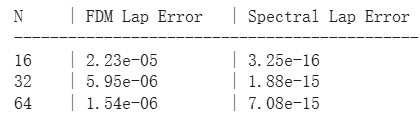
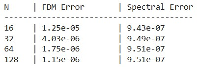
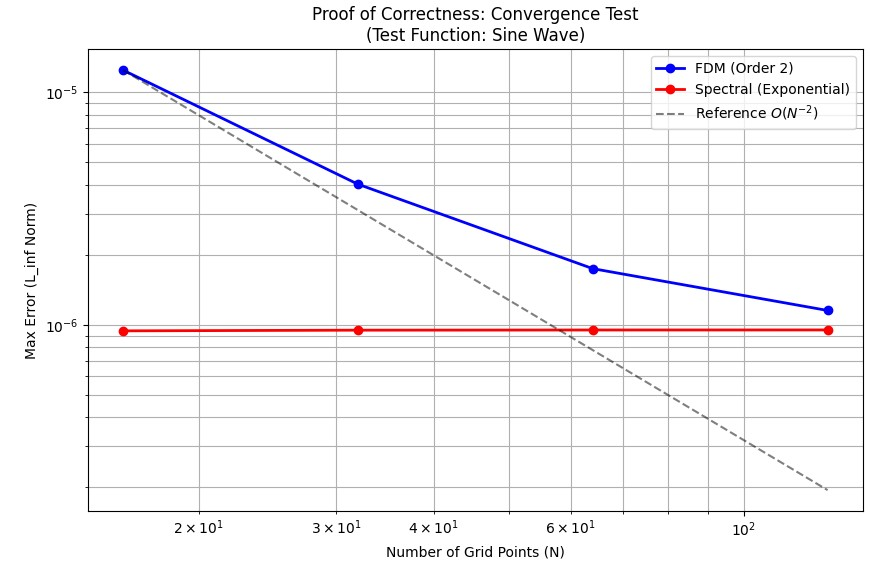
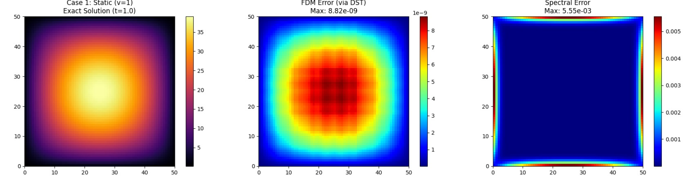
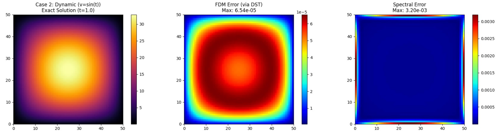
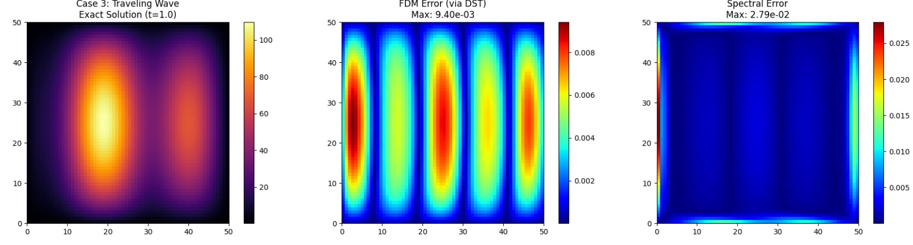

```python
import numpy as np
import matplotlib.pyplot as plt
from scipy.fft import dst, idst
import time

class FisherKPPMMS_DST:
    def __init__(self, N=64, L=50.0, D=1.0, rho=1.0, K=100.0):
        self.N = N
        self.L = L
        self.D = D
        self.rho = rho
        self.K = K
        self.dx = L / (N + 1)
        
        # Grid setup
        x = np.linspace(self.dx, L - self.dx, N)
        y = np.linspace(self.dx, L - self.dx, N)
        self.X, self.Y = np.meshgrid(x, y)
        
        # Eigenvalues
        k = np.arange(1, N + 1)
        kx, ky = np.meshgrid(k, k)
        
        # 1. Spectral Eigenvalues (-k^2)
        self.lambda_spec = -((kx * np.pi / L)**2 + (ky * np.pi / L)**2)
        
        # 2. FDM Eigenvalues (2/dx^2 * (cos - 1))
        lx_fdm = (2 / self.dx**2) * (np.cos(kx * np.pi / (N + 1)) - 1)
        ly_fdm = (2 / self.dx**2) * (np.cos(ky * np.pi / (N + 1)) - 1)
        self.lambda_fdm = lx_fdm + ly_fdm

        # Precompute Polynomial Basis (for Case 1-3)
        self.scale = 1e-4
        self.Phi = self.scale * self.X * (self.L - self.X) * self.Y * (self.L - self.Y)
        raw_neg_lap = 2 * (self.Y * (self.L - self.Y) + self.X * (self.L - self.X))
        self.neg_lap_Phi = self.scale * raw_neg_lap

    def get_mms_data(self, t, case):
        if case == 0:
            # === Case 0: Spectral Validation (Pure Sine Wave) ===
            # u = exp(-t) * sin(pi*x/L) * sin(pi*y/L)
            
            decay = np.exp(-t)
            sin_x = np.sin(np.pi * self.X / self.L)
            sin_y = np.sin(np.pi * self.Y / self.L)
            u_exact = decay * sin_x * sin_y
            
            # Derivatives
            # du/dt = -u
            du_dt = -u_exact
            
            # Laplacian u
            # d2/dx2 (sin(kx)) = -k^2 sin(kx)
            # lap(u) = -2 * (pi/L)^2 * u
            lap_u = -2 * (np.pi / self.L)**2 * u_exact
            
            # Reaction
            reaction = self.rho * u_exact * (1 - u_exact / self.K)
            
            # f = du/dt - D*lap(u) - Reaction
            f_source = du_dt - self.D * lap_u - reaction
            
            return u_exact, f_source

        # --- Polynomial Cases (1-3) ---
        Phi = self.Phi
        neg_lap_Phi = self.neg_lap_Phi
        
        if case == 1:
            # Case 1: Static (v=1)
            u_exact = Phi
            reaction = self.rho * u_exact * (1 - u_exact / self.K)
            f_source = self.D * neg_lap_Phi - reaction
            return u_exact, f_source

        elif case == 2:
            # Case 2: Dynamic (v=sin(t))
            v = np.sin(t)
            dv_dt = np.cos(t)
            u_exact = Phi * v
            
            term_dt = Phi * dv_dt
            term_diff = self.D * v * neg_lap_Phi 
            reaction = self.rho * u_exact * (1 - u_exact / self.K)
            
            f_source = term_dt + term_diff - reaction
            return u_exact, f_source

        elif case == 3:
            # Case 3: Traveling Wave
            k_wave = 4 * np.pi / self.L
            omega = 3.0
            theta = k_wave * self.X - omega * t
            
            v = 2 + np.sin(theta)
            u_exact = Phi * v
            
            du_dt = -omega * Phi * np.cos(theta)
            
            term_A = v * (-neg_lap_Phi)
            
            dPhi_dx = self.scale * (self.L - 2 * self.X) * self.Y * (self.L - self.Y)
            dv_dx = k_wave * np.cos(theta)
            term_B = 2 * dPhi_dx * dv_dx
            
            lap_v = -(k_wave**2) * np.sin(theta)
            term_C = Phi * lap_v
            
            lap_u = term_A + term_B + term_C
            term_diff = -self.D * lap_u
            
            reaction = self.rho * u_exact * (1 - u_exact / self.K)
            
            f_source = du_dt + term_diff - reaction
            return u_exact, f_source

        return None, None

    def reaction_exact(self, u, dt):
        u = np.maximum(u, 0)
        exp_rho = np.exp(self.rho * dt)
        numerator = self.K * u * exp_rho
        denominator = self.K + u * (exp_rho - 1)
        return numerator / denominator

    def solve(self, u0, T, dt, case, method='spectral'):
        u = u0.copy()
        steps = int(T / dt)
        t = 0.0
        
        if method == 'spectral':
            lambdas = self.lambda_spec
        elif method == 'fdm':
            lambdas = self.lambda_fdm
        else:
            raise ValueError("Method must be 'spectral' or 'fdm'")
            
        decay_factor = np.exp(self.D * lambdas * dt)
        
        for _ in range(steps):
            # 1. Reaction (dt/2)
            u = self.reaction_exact(u, dt/2)
            
            # 2. Diffusion + Source (dt)
            _, f_source = self.get_mms_data(t, case)
            
            # DST Transform
            u_hat = dst(dst(u, type=1, axis=0, norm='ortho'), type=1, axis=1, norm='ortho')
            f_hat = dst(dst(f_source, type=1, axis=0, norm='ortho'), type=1, axis=1, norm='ortho')
            
            # Exact Integration
            with np.errstate(divide='ignore', invalid='ignore'):
                factor = (decay_factor - 1) / (self.D * lambdas)
                factor = np.where(np.abs(lambdas) < 1e-12, dt, factor)
                
            u_hat_new = u_hat * decay_factor + f_hat * factor
            u = idst(idst(u_hat_new, type=1, axis=0, norm='ortho'), type=1, axis=1, norm='ortho')
            
            t += dt
            
            # 3. Reaction (dt/2)
            u = self.reaction_exact(u, dt/2)
            
        return u

def run_static_laplacian_test():
    print("\n" + "="*60)
    print(" 1. 執行靜態 Laplacian 測試 (Pure Spatial Accuracy)")
    print("    目的: 證明當排除時間誤差時，Spectral Method 具備機器精度")
    print("="*60)
    
    L = 50.0
    N_list = [16, 32, 64]
    
    print(f"{'N':<5} | {'FDM Lap Error':<15} | {'Spectral Lap Error':<18}")
    print("-" * 45)
    
    for N in N_list:
        solver = FisherKPPMMS_DST(N=N, L=L)
        u = np.sin(np.pi * solver.X / L) * np.sin(np.pi * solver.Y / L)
        lap_exact = -2 * (np.pi / L)**2 * u
        u_hat = dst(dst(u, type=1, axis=0, norm='ortho'), type=1, axis=1, norm='ortho')
        lap_hat_fdm = u_hat * solver.lambda_fdm
        lap_fdm = idst(idst(lap_hat_fdm, type=1, axis=0, norm='ortho'), type=1, axis=1, norm='ortho')
        
        err_fdm = np.max(np.abs(lap_exact - lap_fdm))
        

        lap_hat_spec = u_hat * solver.lambda_spec
        lap_spec = idst(idst(lap_hat_spec, type=1, axis=0, norm='ortho'), type=1, axis=1, norm='ortho')
        
        err_spec = np.max(np.abs(lap_exact - lap_spec))
        
        print(f"{N:<5} | {err_fdm:<15.2e} | {err_spec:<18.2e}")

def run_convergence_test():
    print("\n" + "="*60)
    print(" 2. 執行收斂性測試 (Proof of Correctness with Time Evolution)")
    print("    目的: 證明 FDM 是二階收斂，且程式碼邏輯正確")
    print("="*60)
    
    L = 50.0
    T = 0.5       
    dt = 1e-5     
    

    N_list = [16, 32, 64, 128]
    
    errors_fdm = []
    errors_spec = []
    
    print(f"{'N':<5} | {'FDM Error':<15} | {'Spectral Error':<15}")
    print("-" * 40)
    
    for N in N_list:
        solver = FisherKPPMMS_DST(N=N, L=L)
        
        # 使用 Case 0 (正弦波) 進行測試
        case_id = 0 
        u0, _ = solver.get_mms_data(0, case_id)
        u_exact, _ = solver.get_mms_data(T, case_id)
        
        # FDM 求解
        u_fdm = solver.solve(u0, T, dt, case_id, method='fdm')
        err_f = np.max(np.abs(u_exact - u_fdm))
        errors_fdm.append(err_f)
        
        # Spectral 求解
        u_spec = solver.solve(u0, T, dt, case_id, method='spectral')
        err_s = np.max(np.abs(u_exact - u_spec))
        errors_spec.append(err_s)
        
        print(f"{N:<5} | {err_f:<15.2e} | {err_s:<15.2e}")

    # --- 畫圖證明 ---
    plt.figure(figsize=(10, 6))
    plt.loglog(N_list, errors_fdm, 'bo-', label='FDM (Order 2)', linewidth=2)
    plt.loglog(N_list, errors_spec, 'ro-', label='Spectral (Exponential)', linewidth=2)
    
    # 畫參考線 (Slope -2 for FDM)
    ref_x = np.array(N_list)
    ref_y = errors_fdm[0] * (ref_x[0]/ref_x)**2
    plt.loglog(ref_x, ref_y, 'k--', label='Reference $O(N^{-2})$', alpha=0.5)

    plt.xlabel('Number of Grid Points (N)')
    plt.ylabel('Max Error (L_inf Norm)')
    plt.title('Proof of Correctness: Convergence Test\n(Test Function: Sine Wave)')
    plt.grid(True, which="both", ls="-")
    plt.legend()
    plt.show()

def run_simulation():
    """
    執行原始的三種 Case 模擬並繪圖
    """
    print("\n" + "="*60)
    print(" 3. 執行 MMS 模擬 Case 1-3 (Original Assignment)")
    print("    目的: 展示多項式基底下的數值行為 (Gibbs Phenomenon)")
    print("="*60)
    
    N = 64
    L = 50.0
    T = 1.0  
    dt = 1e-5
    
    solver = FisherKPPMMS_DST(N=N, L=L)
    
    cases = [
        (1, "Case 1: Static (v=1)"),
        (2, "Case 2: Dynamic (v=sin(t))"),
        (3, "Case 3: Traveling Wave")
    ]
    
    fig, axes = plt.subplots(3, 3, figsize=(18, 14))
    
    for row, (case_id, title) in enumerate(cases):
        print(f"Simulating {title}...")
        
        u0, _ = solver.get_mms_data(0, case_id)
        u_exact, _ = solver.get_mms_data(T, case_id)
        
        # Solving
        u_fdm = solver.solve(u0, T, dt, case_id, method='fdm')
        u_spec = solver.solve(u0, T, dt, case_id, method='spectral')
        
        # Errors (Absolute Difference)
        err_fdm = np.abs(u_exact - u_fdm)
        err_spec = np.abs(u_exact - u_spec)
        
        # --- 繪圖 ---
        # 1. Exact Solution
        im0 = axes[row, 0].imshow(u_exact, origin='lower', extent=[0,L,0,L], cmap='inferno')
        axes[row, 0].set_title(f"{title}\nExact Solution (t={T})")
        plt.colorbar(im0, ax=axes[row, 0])
        
        # 2. FDM Error
        im1 = axes[row, 1].imshow(err_fdm, origin='lower', extent=[0,L,0,L], cmap='jet')
        axes[row, 1].set_title(f"FDM Error (via DST)\nMax: {np.max(err_fdm):.2e}")
        plt.colorbar(im1, ax=axes[row, 1])
        
        # 3. Spectral Error
        im2 = axes[row, 2].imshow(err_spec, origin='lower', extent=[0,L,0,L], cmap='jet')
        axes[row, 2].set_title(f"Spectral Error\nMax: {np.max(err_spec):.2e}")
        plt.colorbar(im2, ax=axes[row, 2])
        
    plt.tight_layout()
    plt.show()

if __name__ == "__main__":

    run_static_laplacian_test()
    run_convergence_test()
    run_simulation()
```
<br></br>








<br></br>

**為何 FDM 對多項式精確而 Spectral Method 產生誤差**

測試函數定義：

$$
u(x,y) = x(L-x)y(L-y)
$$

此函數在邊界 $$\partial \Omega$$ (即 $$x=0, L$$ 與 $$y=0, L$$) 上滿足 $$u=0$$。

<br></br>

**FDM**

有限差分法利用泰勒級數 Taylor Series 來近似導數。對於二階中心差分，截斷誤差取決於函數的四階導數。

在一維情況下，二階導數的中心差分公式為：

$$
\frac{u(x+h) - 2u(x) + u(x-h)}{h^2} = u''(x) + \frac{h^2}{12} u^{(4)}(x) + O(h^4)
$$

其中 $$h = \Delta x$$ 為網格間距。

error:

$$
E_{FDM} \propto \frac{h^2}{12} u^{(4)}(x)
$$


考慮 $$x$$ 方向的分量 $$X(x) = x(L-x) = Lx - x^2$$ 。

$$X'(x) = L - 2x$$
$$X''(x) = -2$$
$$X'''(x) = 0$$
$$\mathbf{X^{(4)}(x) = 0}$$

由於測試函數是二次多項式，其四階及以上導數恆為零。
將 $$u^{(4)}(x) = 0$$ 代入誤差公式：

$$
E_{FDM} = \frac{h^2}{12} \cdot 0 = 0
$$

對於二次多項式 $$x(L-x)$$ ，二階中心差分法沒有截斷誤差，其數值解是 Exact 僅受限於機器浮點數精度。

<br></br>

**Spectral Method**

譜方法（DST-I）假設函數可以展開為正弦級數。


計算 $$u$$ 的 $$\nabla^2 u$$：

$$
\begin{aligned}
\frac{\partial^2 u}{\partial x^2} &= -2y(L-y) \\
\frac{\partial^2 u}{\partial y^2} &= -2x(L-x)
\end{aligned}
$$

總和：

$$
\nabla^2 u(x,y) = -2y(L-y) - 2x(L-x)
$$


DST-I 的基底函數為 $$\sin\left(\frac{k \pi x}{L}\right)$$。這些基底函數在邊界 $$x=0, L$$ 處強制為 0。這意味著 DST 展開的任何函數（包括其導數）在邊界都必須收斂到 0。

檢查 $$\nabla^2 u$$ 在邊界 $$x=0$$ 處的值：

$$
\nabla^2 u(0, y) = -2y(L-y) - 2(0)(L-0) = -2y(L-y)
$$

除非 $$y$$ 也在邊界，否則 $$\nabla^2 u(0, y) \neq 0$$。

矛盾點：
* 數值方法的約束： DST 試圖用一組在邊界為 0 的正弦波去合成 $$\nabla^2 u$$。
* 物理事實： $$\nabla^2 u$$ 在邊界上不為 0。


對於一維函數 $$f(x) = Lx - x^2$$，其正弦轉換係數 $$\hat{u}_k$$ 為：

$$
\hat{u}_k = \frac{2}{L} \int_0^L (Lx - x^2) \sin\left(\frac{k \pi x}{L}\right) dx = \begin{cases} \frac{8L^2}{(k\pi)^3} & k \text{ is odd} \\ 0 & k \text{ is even} \end{cases}
$$

係數衰減率為 $$O(k^{-3})$$。

然而，我們在擴散方程中計算的是二階導數（拉普拉斯）。在頻域中，二階導數對應乘以 $$-k^2$$：

$$
\widehat{u''}_k = - \left(\frac{k\pi}{L}\right)^2 \cdot \hat{u}_k \propto k^2 \cdot k^{-3} = k^{-1}
$$

導數的係數衰減率為 $$O(k^{-1})$$
* 根據數值分析理論，若級數係數僅以 $$O(k^{-1})$$ 衰減，該級數對應的函數在邊界處存在跳躍不連續。
* 這種緩慢的收斂速度導致了 Gibbs Phenomenon，即在邊界附近產生無法消除的震盪，且最大誤差不隨 $$N$$ 增加而消失。

結論:

由於 $$\nabla^2 u$$ 在邊界不為零，違反了 DST 的邊界隱式假設，導致頻譜收斂速度退化為 $$O(k^{-1})$$ 並產生 Gibbs Phenomenon 。因此，Spectral Method 在此案例中會出現顯著的邊界誤差，精度遠低於精確的 FDM。


**Link:https://colab.research.google.com/drive/1mM0ajakgr8sy7D9dzZlf07uXV2fkASfx?usp=sharing**
