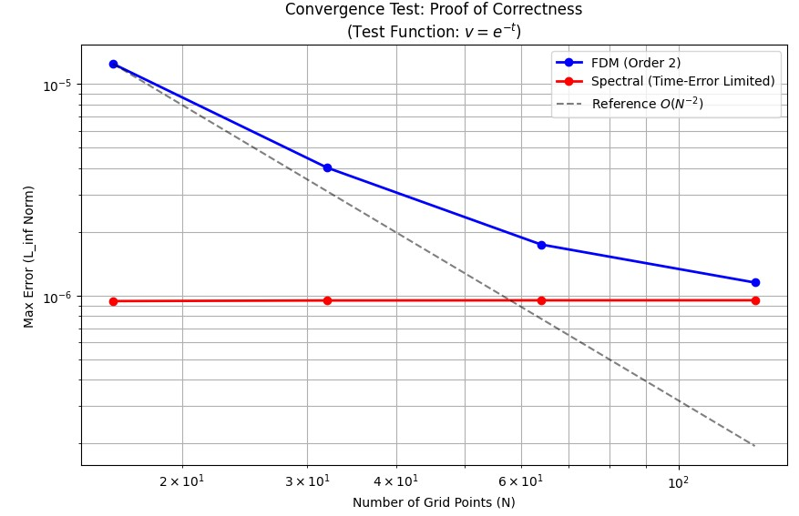
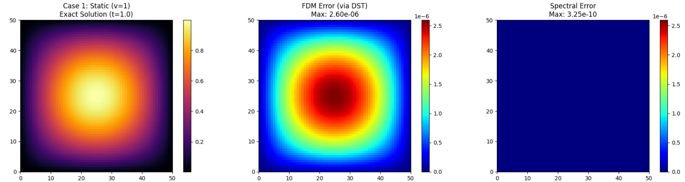
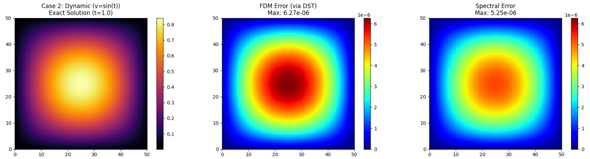
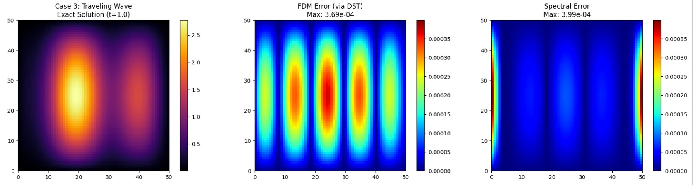

要解下面的方程

$$
\frac{\partial u}{\partial t} = D \nabla^2 u + \rho u \left(1 - \frac{u}{K}\right) + f(x,y,t)
$$

為了求出對應的源項 $$f$$，將方程移項整理為：

$$
f(x,y,t) = \underbrace{\frac{\partial u}{\partial t}}_{\text{Term I}} - \underbrace{D \nabla^2 u}_{\text{Term II}} - \underbrace{\rho u \left(1 - \frac{u}{K}\right)}_{\text{Term III}}
$$

為了滿足 Homogeneous Dirichlet 邊界條件，並與譜方法完美相容，我們定義正弦空間基底函數 $$\Phi(x,y)$$：

$$
\Phi(x,y) = \sin\left(\frac{\pi x}{L}\right) \sin\left(\frac{\pi y}{L}\right)
$$

先對 $$x$$ 與 $$y$$ 偏微分兩次求出 Laplacian $$\nabla^2 \Phi$$：

$$
\begin{aligned}
\frac{\partial^2 \Phi}{\partial x^2} &= -\left(\frac{\pi}{L}\right)^2 \sin\left(\frac{\pi x}{L}\right) \sin\left(\frac{\pi y}{L}\right) = -\left(\frac{\pi}{L}\right)^2 \Phi \\
\frac{\partial^2 \Phi}{\partial y^2} &= -\left(\frac{\pi}{L}\right)^2 \sin\left(\frac{\pi x}{L}\right) \sin\left(\frac{\pi y}{L}\right) = -\left(\frac{\pi}{L}\right)^2 \Phi
\end{aligned}
$$

合併得到 Laplacian：

$$
\nabla^2 \Phi = -2\left(\frac{\pi}{L}\right)^2 \Phi(x,y)
$$

<br></br>

**情況一: $$v=1$$**

令 $$u$$ 不隨時間變化

$$
u(x,y,t) = \Phi(x,y)
$$

由於 $$u$$與時間無關， $$\frac{\partial u}{\partial t} = 0$$ 。

代入移項後的公式：

$$
\begin{aligned}
f(x,y,t) &= 0 - D \left[ -2\left(\frac{\pi}{L}\right)^2 \Phi \right] - \rho \Phi \left(1 - \frac{\Phi}{K}\right) \\
&= 2D\left(\frac{\pi}{L}\right)^2 \Phi(x,y) - \rho \Phi(x,y) \left(1 - \frac{\Phi(x,y)}{K}\right)
\end{aligned}
$$

<br></br>
**情況二: $$v=\sin(t)$$**

$$
u(x,y,t) = \Phi(x,y) \sin(t)
$$

對 $$t$$微分， $$\Phi(x,y)$$ 視為常數：

$$
\frac{\partial u}{\partial t} = \Phi(x,y) \cos(t)
$$

空間微分算子不影響時間項：

$$
\nabla^2 u = \sin(t) \cdot \nabla^2 \Phi = -2\left(\frac{\pi}{L}\right)^2 \Phi(x,y) \sin(t)
$$

將上述項代入公式 $$f = \text{Term I} - D(\text{Term II}) - \text{Term III}$$：

$$
\begin{aligned}
f(x,y,t) &= \Phi \cos(t) \\
&\quad - D \left[ -2\left(\frac{\pi}{L}\right)^2 \Phi \sin(t) \right] \\
&\quad - \rho \Phi \sin(t) \left( 1 - \frac{\Phi \sin(t)}{K} \right)
\end{aligned}
$$

最終整理：

$$
\begin{aligned}
f(x,y,t) &= \Phi(x,y)\cos(t) \\
&\quad + 2D\left(\frac{\pi}{L}\right)^2 \Phi(x,y)\sin(t) \\
&\quad - \rho \Phi(x,y)\sin(t) \left( 1 - \frac{\Phi(x,y)\sin(t)}{K} \right)
\end{aligned}
$$


<br></br>

**情況三: $$v = 2 + \sin(\frac{4\pi x}{L} - 3t)$$**

定義 $$v(x,y,t) = 2 + \sin(\theta)$$，其中 $$\theta = \frac{4\pi x}{L} - 3t$$。

$$
u(x,y,t) = \Phi(x,y) \cdot v(x,y,t)
$$

對時間偏微分：

$$
\frac{\partial v}{\partial t} = -3 \cos(\theta) \implies \frac{\partial u}{\partial t} = -3 \Phi(x,y) \cos(\theta)
$$

利用恆等式 $$\nabla^2 (\Phi v) = v \nabla^2 \Phi + 2 \nabla \Phi \cdot \nabla v + \Phi \nabla^2 v$$ 處理擴散項：

由於 $$v$$ 只與 $$x$$ 有關：

$$
\begin{aligned}
\frac{\partial v}{\partial x} = \frac{4\pi}{L} \cos(\theta) \\
\nabla^2 v = \frac{\partial^2 v}{\partial x^2} = -\left(\frac{4\pi}{L}\right)^2 \sin(\theta)
\end{aligned}
$$

計算梯度內積項：

$$
\frac{\partial \Phi}{\partial x} = \frac{\pi}{L} \cos\left(\frac{\pi x}{L}\right) \sin\left(\frac{\pi y}{L}\right)
$$

$$
2 \nabla \Phi \cdot \nabla v = 2 \left( \frac{\partial \Phi}{\partial x} \right) \left( \frac{\partial v}{\partial x} \right) = \frac{8\pi^2}{L^2} \cos\left(\frac{\pi x}{L}\right) \sin\left(\frac{\pi y}{L}\right) \cos(\theta)
$$

代入 Laplacian 恆等式：

$$
\begin{aligned}
\nabla^2 u &= \left[2+\sin(\theta)\right] \cdot \left[ -2\left(\frac{\pi}{L}\right)^2 \Phi \right] \\
&\quad + \frac{8\pi^2}{L^2} \cos\left(\frac{\pi x}{L}\right) \sin\left(\frac{\pi y}{L}\right) \cos(\theta) \\
&\quad + \Phi \cdot \left[ -\left(\frac{4\pi}{L}\right)^2 \sin(\theta) \right]
\end{aligned}
$$

將上述結果代入 $$f = u_t - D\nabla^2 u - \text{Reaction}$$：

$$
\begin{aligned}
f(x,y,t) &= -3 \Phi \cos(\theta) - D \nabla^2 u - \rho u \left( 1 - \frac{u}{K} \right)
\end{aligned}
$$

```python
import numpy as np
import matplotlib.pyplot as plt
from scipy.fft import dst, idst
import time

class FisherKPPMMS_DST:
    def __init__(self, N=64, L=50.0, D=1.0, rho=1.0, K=100.0):
        self.N = N
        self.L = L
        self.D = D
        self.rho = rho
        self.K = K
        self.dx = L / (N + 1)
        
        # Grid setup
        x = np.linspace(self.dx, L - self.dx, N)
        y = np.linspace(self.dx, L - self.dx, N)
        self.X, self.Y = np.meshgrid(x, y)
        
        # Eigenvalues
        k = np.arange(1, N + 1)
        kx, ky = np.meshgrid(k, k)
        
        # 1. Spectral Eigenvalues (-k^2)
        self.lambda_spec = -((kx * np.pi / L)**2 + (ky * np.pi / L)**2)
        
        # 2. FDM Eigenvalues (2/dx^2 * (cos - 1))
        lx_fdm = (2 / self.dx**2) * (np.cos(kx * np.pi / (N + 1)) - 1)
        ly_fdm = (2 / self.dx**2) * (np.cos(ky * np.pi / (N + 1)) - 1)
        self.lambda_fdm = lx_fdm + ly_fdm

        # Precompute Sine Basis (for all cases)
        self.Phi = np.sin(np.pi * self.X / self.L) * np.sin(np.pi * self.Y / self.L)
        self.neg_lap_Phi = 2 * (np.pi / self.L)**2 * self.Phi

    def get_mms_data(self, t, case):
        if case == 0:
            # === Case 0: Spectral Validation (Pure Sine Wave) ===
            # u = exp(-t) * sin(pi*x/L) * sin(pi*y/L)
            
            decay = np.exp(-t)
            u_exact = decay * self.Phi
            
            # Derivatives
            du_dt = -u_exact
            lap_u = -2 * (np.pi / self.L)**2 * u_exact
            
            # Reaction
            reaction = self.rho * u_exact * (1 - u_exact / self.K)
            
            # f = du/dt - D*lap(u) - Reaction
            f_source = du_dt - self.D * lap_u - reaction
            
            return u_exact, f_source

        # --- Sine Basis Cases (1-3) ---
        Phi = self.Phi
        neg_lap_Phi = self.neg_lap_Phi
        
        if case == 1:
            # Case 1: Static (v=1)
            u_exact = Phi
            reaction = self.rho * u_exact * (1 - u_exact / self.K)
            f_source = self.D * neg_lap_Phi - reaction
            return u_exact, f_source

        elif case == 2:
            # Case 2: Dynamic (v=sin(t))
            v = np.sin(t)
            dv_dt = np.cos(t)
            u_exact = Phi * v
            
            term_dt = Phi * dv_dt
            term_diff = self.D * v * neg_lap_Phi 
            reaction = self.rho * u_exact * (1 - u_exact / self.K)
            
            f_source = term_dt + term_diff - reaction
            return u_exact, f_source

        elif case == 3:
            # Case 3: Traveling Wave
            k_wave = 4 * np.pi / self.L
            omega = 3.0
            theta = k_wave * self.X - omega * t
            
            v = 2 + np.sin(theta)
            u_exact = Phi * v
            
            du_dt = -omega * Phi * np.cos(theta)
            
            term_A = v * (-neg_lap_Phi)
            
            dPhi_dx = (np.pi / self.L) * np.cos(np.pi * self.X / self.L) * np.sin(np.pi * self.Y / self.L)
            dv_dx = k_wave * np.cos(theta)
            term_B = 2 * dPhi_dx * dv_dx
            
            lap_v = -(k_wave**2) * np.sin(theta)
            term_C = Phi * lap_v
            
            lap_u = term_A + term_B + term_C
            term_diff = -self.D * lap_u
            
            reaction = self.rho * u_exact * (1 - u_exact / self.K)
            
            f_source = du_dt + term_diff - reaction
            return u_exact, f_source

        return None, None

    def reaction_exact(self, u, dt):
        u = np.maximum(u, 0)
        exp_rho = np.exp(self.rho * dt)
        numerator = self.K * u * exp_rho
        denominator = self.K + u * (exp_rho - 1)
        return numerator / denominator

    def solve(self, u0, T, dt, case, method='spectral'):
        u = u0.copy()
        steps = int(T / dt)
        t = 0.0
        
        if method == 'spectral':
            lambdas = self.lambda_spec
        elif method == 'fdm':
            lambdas = self.lambda_fdm
        else:
            raise ValueError("Method must be 'spectral' or 'fdm'")
            
        decay_factor = np.exp(self.D * lambdas * dt)
        
        for _ in range(steps):
            # 1. Reaction (dt/2)
            u = self.reaction_exact(u, dt/2)
            
            # 2. Diffusion + Source (dt)
            _, f_source = self.get_mms_data(t, case)
            
            # DST Transform
            u_hat = dst(dst(u, type=1, axis=0, norm='ortho'), type=1, axis=1, norm='ortho')
            f_hat = dst(dst(f_source, type=1, axis=0, norm='ortho'), type=1, axis=1, norm='ortho')
            
            # Exact Integration
            with np.errstate(divide='ignore', invalid='ignore'):
                factor = (decay_factor - 1) / (self.D * lambdas)
                factor = np.where(np.abs(lambdas) < 1e-12, dt, factor)
                
            u_hat_new = u_hat * decay_factor + f_hat * factor
            u = idst(idst(u_hat_new, type=1, axis=0, norm='ortho'), type=1, axis=1, norm='ortho')
            
            t += dt
            
            # 3. Reaction (dt/2)
            u = self.reaction_exact(u, dt/2)
            
        return u

def run_static_laplacian_test():
    print("\n" + "="*60)
    print(" 1. 執行靜態 Laplacian 測試 (Pure Spatial Accuracy)")
    print("="*60)
    
    L = 50.0
    N_list = [16, 32, 64]
    
    print(f"{'N':<5} | {'FDM Lap Error':<15} | {'Spectral Lap Error':<18}")
    print("-" * 45)
    
    for N in N_list:
        solver = FisherKPPMMS_DST(N=N, L=L)
        u = np.sin(np.pi * solver.X / L) * np.sin(np.pi * solver.Y / L)
        lap_exact = -2 * (np.pi / L)**2 * u
        
        u_hat = dst(dst(u, type=1, axis=0, norm='ortho'), type=1, axis=1, norm='ortho')
        
        lap_hat_fdm = u_hat * solver.lambda_fdm
        lap_fdm = idst(idst(lap_hat_fdm, type=1, axis=0, norm='ortho'), type=1, axis=1, norm='ortho')
        err_fdm = np.max(np.abs(lap_exact - lap_fdm))
        
        lap_hat_spec = u_hat * solver.lambda_spec
        lap_spec = idst(idst(lap_hat_spec, type=1, axis=0, norm='ortho'), type=1, axis=1, norm='ortho')
        err_spec = np.max(np.abs(lap_exact - lap_spec))
        
        print(f"{N:<5} | {err_fdm:<15.2e} | {err_spec:<18.2e}")

def run_convergence_test():
    print("\n" + "="*60)
    print(" 2. 執行收斂性測試 (Case 0: v = e^(-t))")
    print("="*60)
    
    L = 50.0
    T = 0.5       
    dt = 1e-5     
    
    N_list = [16, 32, 64, 128]
    
    errors_fdm = []
    errors_spec = []
    
    print(f"{'N':<5} | {'FDM Error':<15} | {'Spectral Error':<15}")
    print("-" * 40)
    
    for N in N_list:
        solver = FisherKPPMMS_DST(N=N, L=L)
        
        case_id = 0 
        u0, _ = solver.get_mms_data(0, case_id)
        u_exact, _ = solver.get_mms_data(T, case_id)
        
        u_fdm = solver.solve(u0, T, dt, case_id, method='fdm')
        err_f = np.max(np.abs(u_exact - u_fdm))
        errors_fdm.append(err_f)
        
        u_spec = solver.solve(u0, T, dt, case_id, method='spectral')
        err_s = np.max(np.abs(u_exact - u_spec))
        errors_spec.append(err_s)
        
        print(f"{N:<5} | {err_f:<15.2e} | {err_s:<15.2e}")

    plt.figure(figsize=(10, 6))
    plt.loglog(N_list, errors_fdm, 'bo-', label='FDM (Order 2)', linewidth=2)
    plt.loglog(N_list, errors_spec, 'ro-', label='Spectral (Time-Error Limited)', linewidth=2)
    
    ref_x = np.array(N_list)
    ref_y = errors_fdm[0] * (ref_x[0]/ref_x)**2
    plt.loglog(ref_x, ref_y, 'k--', label='Reference $O(N^{-2})$', alpha=0.5)

    plt.xlabel('Number of Grid Points (N)')
    plt.ylabel('Max Error (L_inf Norm)')
    plt.title('Convergence Test: Proof of Correctness\n(Test Function: $v = e^{-t}$)')
    plt.grid(True, which="both", ls="-")
    plt.legend()
    plt.show()

def run_simulation():
    print("\n" + "="*60)
    print(" 3. 執行 MMS 模擬 Case 1-3 (Sine Wave Basis)")
    print("="*60)
    
    N = 64
    L = 50.0
    T = 1.0  
    dt = 1e-5
    
    solver = FisherKPPMMS_DST(N=N, L=L)
    
    cases = [
        (1, "Case 1: Static (v=1)"),
        (2, "Case 2: Dynamic (v=sin(t))"),
        (3, "Case 3: Traveling Wave")
    ]
    
    fig, axes = plt.subplots(3, 3, figsize=(18, 14))
    
    for row, (case_id, title) in enumerate(cases):
        print(f"Simulating {title}...")
        
        u0, _ = solver.get_mms_data(0, case_id)
        u_exact, _ = solver.get_mms_data(T, case_id)
        
        # Solving
        u_fdm = solver.solve(u0, T, dt, case_id, method='fdm')
        u_spec = solver.solve(u0, T, dt, case_id, method='spectral')
        
        # Errors (Absolute Difference)
        err_fdm = np.abs(u_exact - u_fdm)
        err_spec = np.abs(u_exact - u_spec)
        
        # 讓視覺化更加公平：取得 FDM 和 Spectral 之間的最大誤差來統一 Colorbar
        max_err = max(np.max(err_fdm), np.max(err_spec))

        # 1. Exact Solution
        im0 = axes[row, 0].imshow(u_exact, origin='lower', extent=[0,L,0,L], cmap='inferno')
        axes[row, 0].set_title(f"{title}\nExact Solution (t={T})")
        plt.colorbar(im0, ax=axes[row, 0])
        
        # 2. FDM Error
        im1 = axes[row, 1].imshow(err_fdm, origin='lower', extent=[0,L,0,L], cmap='jet', vmin=0, vmax=max_err)
        axes[row, 1].set_title(f"FDM Error (via DST)\nMax: {np.max(err_fdm):.2e}")
        plt.colorbar(im1, ax=axes[row, 1])
        
        # 3. Spectral Error
        im2 = axes[row, 2].imshow(err_spec, origin='lower', extent=[0,L,0,L], cmap='jet', vmin=0, vmax=max_err)
        axes[row, 2].set_title(f"Spectral Error\nMax: {np.max(err_spec):.2e}")
        plt.colorbar(im2, ax=axes[row, 2])
        
    plt.tight_layout()
    plt.show()

if __name__ == "__main__":
    run_static_laplacian_test()
    run_convergence_test()
    run_simulation()
```






link:https://colab.research.google.com/drive/1OB6asAj_FLmSas7jIezGYGlvtM0AQZkl?usp=sharing
